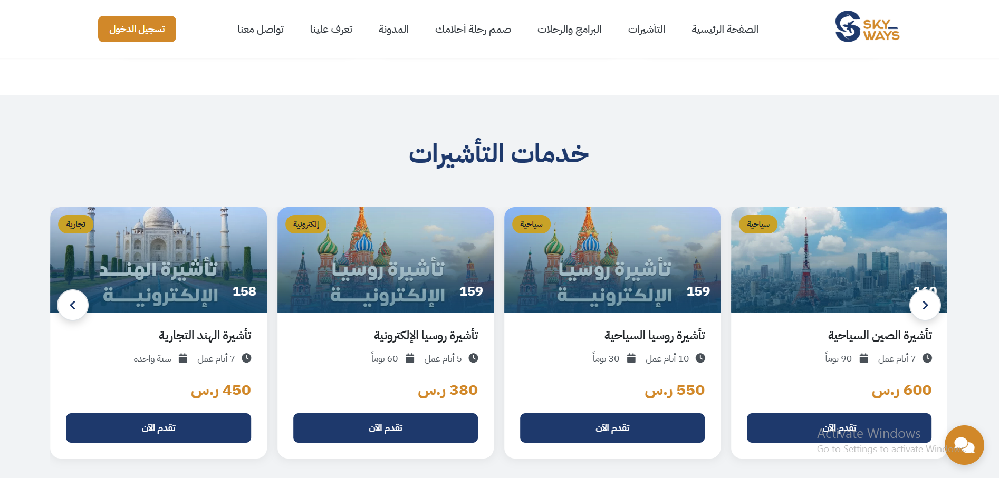
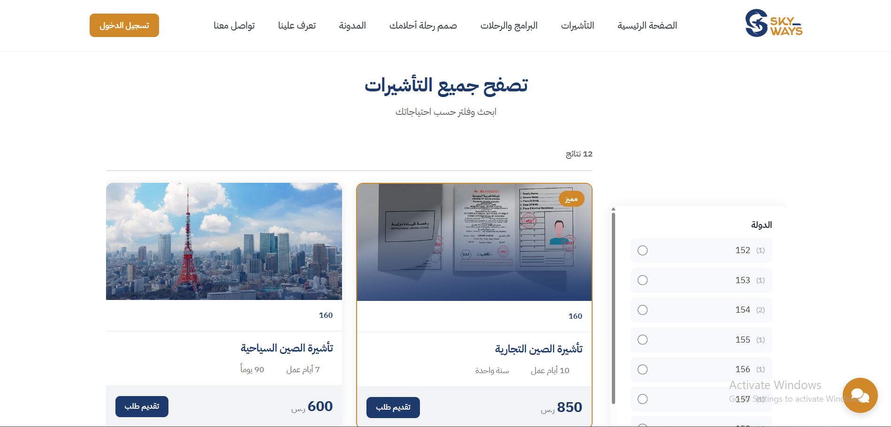
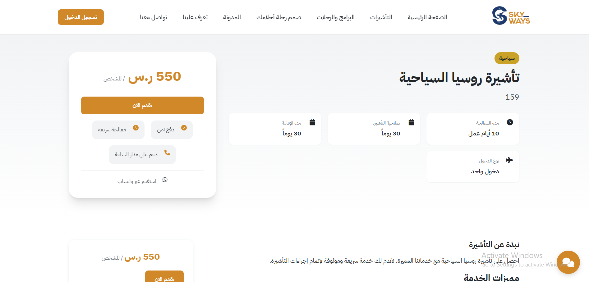
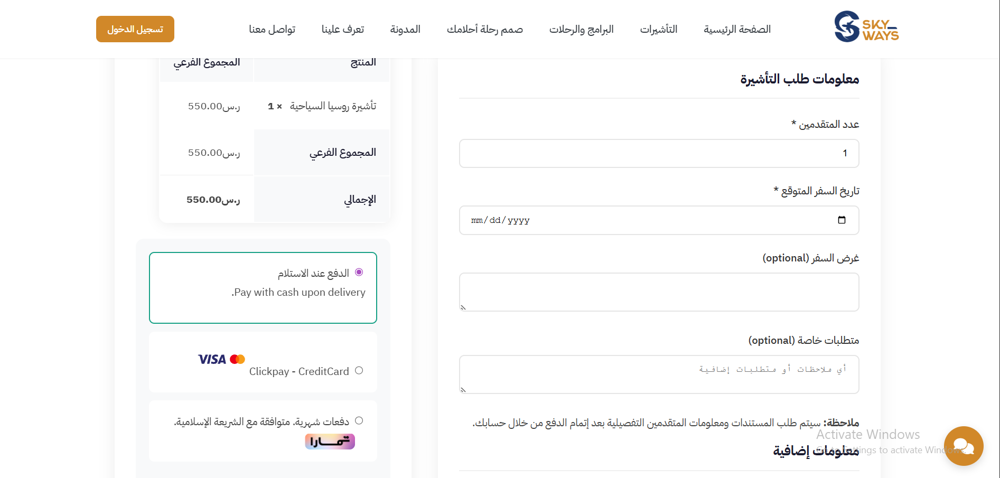
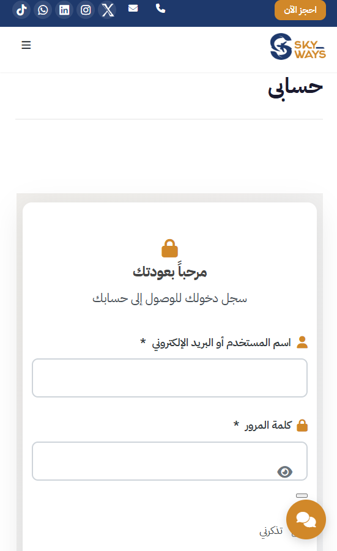
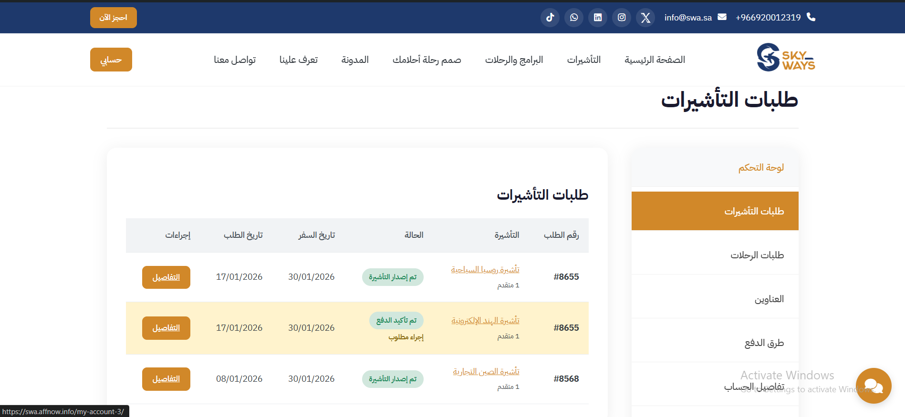
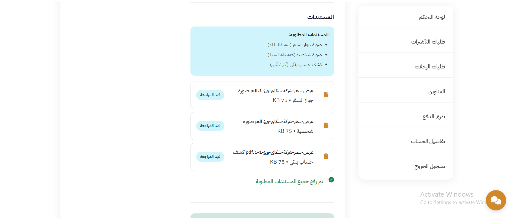
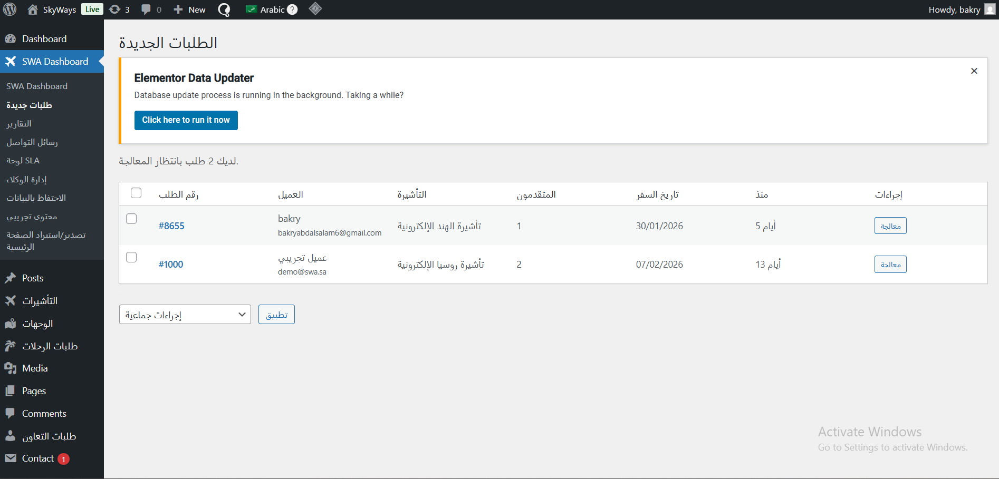
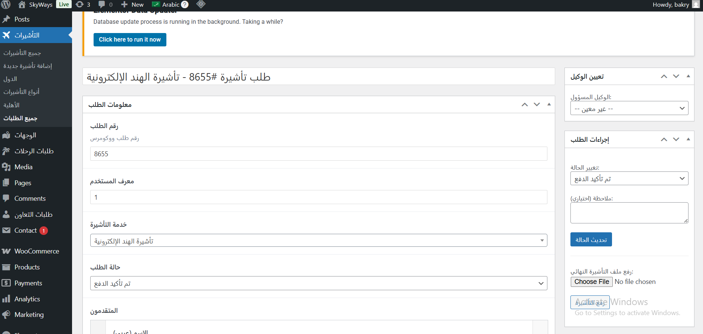

# دليل الإدارة - نظام إدارة التأشيرات SWA

## 📋 نظرة عامة

هذا الدليل موجه لفريق الإدارة لفهم كيفية عمل نظام إدارة التأشيرات وكيفية إدارة البيانات والطلبات بشكل آمن وفعال.

---

## 🎯 نظرة عامة على النظام

**نظام SWA Visa Commerce** هو نظام متكامل لإدارة خدمات التأشيرات تم تطويره خصيصاً لشركتكم. النظام مبني على منصة WordPress مع تكامل كامل مع WooCommerce للمدفوعات.

### المكونات الرئيسية:

1. **عرض خدمات التأشيرات**: عرض جميع خدمات التأشيرات المتاحة مع التفاصيل والأسعار
2. **نظام الطلبات**: إدارة كاملة لطلبات التأشيرات من البداية حتى الإصدار
3. **نظام المدفوعات**: تكامل مع WooCommerce لمعالجة المدفوعات
4. **إدارة المستندات**: رفع وتخزين آمن لمستندات العملاء
5. **لوحة تحكم الإدارة**: لوحة شاملة لإدارة جميع الطلبات والبيانات
6. **صفحة حساب العميل**: واجهة للعملاء لمتابعة طلباتهم

---

## 🔄 سير العمل التفصيلي (Detailed Workflow)

### 📊 المخطط الشامل لسير العمل

```
┌─────────────────────────────────────────────────────────────────┐
│                    رحلة طلب التأشيرة الكاملة                      │
└─────────────────────────────────────────────────────────────────┘

[العميل]                    [النظام]                    [الموظف]
    │                           │                           │
    ├─ 1. زيارة الموقع          │                           │
    │   واستعراض التأشيرات       │                           │
    │                           │                           │
    ├─ 2. اختيار التأشيرة       │                           │
    │   وإضافة للسلة            │                           │
    │                           │                           │
    ├─ 3. الدخول لصفحة الدفع     │                           │
    │   وملء البيانات           │                           │
    │                           │                           │
    ├─ 4. إتمام الدفع            │                           │
    │                           ├─ 5. إنشاء طلب تلقائياً   │
    │                           │   وربطه بالدفع            │
    │                           │                           │
    │                           ├─ 6. إرسال إشعار للعميل    │
    │                           │                           │
    ├─ 7. استلام الإشعار        │                           │
    │   والدخول للحساب          │                           │
    │                           │                           │
    ├─ 8. رفع المستندات         │                           │
    │                           ├─ 9. حفظ المستندات         │
    │                           │   بشكل آمن                 │
    │                           │                           ├─ 10. استلام إشعار
    │                           │                           │   بطلب جديد
    │                           │                           │
    │                           │                           ├─ 11. فتح الطلب
    │                           │                           │   ومراجعة البيانات
    │                           │                           │
    │                           │                           ├─ 12. مراجعة المستندات
    │                           │                           │   والتحقق منها
    │                           │                           │
    │                           │                           ├─ 13. تحديث حالة الطلب
    │                           │                           │   (مراجعة المستندات)
    │                           │                           │
    │                           ├─ 14. إرسال إشعار للعميل    │
    │                           │   بتحديث الحالة           │
    │                           │                           │
    ├─ 15. استلام الإشعار        │                           │
    │                           │                           │
    │                           │                           ├─ 16. معالجة الطلب
    │                           │                           │   (التواصل مع السفارة)
    │                           │                           │
    │                           │                           ├─ 17. تحديث الحالة
    │                           │                           │   (قيد المعالجة)
    │                           │                           │
    │                           ├─ 18. إرسال إشعار للعميل    │
    │                           │                           │
    │                           │                           ├─ 19. إصدار التأشيرة
    │                           │                           │   ورفعها للنظام
    │                           │                           │
    │                           │                           ├─ 20. تحديث الحالة
    │                           │                           │   (تم الإصدار)
    │                           │                           │
    │                           ├─ 21. إرسال إشعار للعميل    │
    │                           │   بإصدار التأشيرة         │
    │                           │                           │
    ├─ 22. استلام الإشعار        │                           │
    │   وفتح الحساب             │                           │
    │                           │                           │
    ├─ 23. تحميل التأشيرة        │                           │
    │                           │                           │
    │                           │                           ├─ 24. إتمام الطلب
    │                           │                           │   وتحديث الحالة
    │                           │                           │
    └───────────────────────────┴───────────────────────────┘
```

---

## 👤 سير العمل من جهة العميل (خطوة بخطوة)

### المرحلة 1: استعراض واختيار التأشيرة

#### الخطوة 1.1: زيارة الموقع
- العميل يفتح الموقع في المتصفح
- يرى الصفحة الرئيسية مع خدمات التأشيرات



*الصفحة الرئيسية تعرض قائمة بجميع خدمات التأشيرات المتاحة*

#### الخطوة 1.2: البحث والفلترة
- العميل يمكنه:
  - البحث عن تأشيرة دولة معينة
  - استخدام الفلاتر (نوع التأشيرة، السعر، مدة المعالجة)
  - تصفح حسب التصنيفات



*صفحة التأشيرات مع أدوات البحث والفلترة حسب الدولة والنوع*

#### الخطوة 1.3: عرض تفاصيل التأشيرة
- العميل ينقر على تأشيرة معينة
- يرى:
  - السعر
  - مدة المعالجة
  - مدة الصلاحية
  - المتطلبات
  - المستندات المطلوبة
  - ملاحظات مهمة

: صفحة تفاصيل التأشيرة


*صفحة تفاصيل التأشيرة تعرض السعر والمدة والمتطلبات*

#### الخطوة 1.4: إضافة للسلة
- العميل ينقر على زر "احجز الآن" أو "أضف للسلة"
- يتم توجيهه مباشرة لصفحة الدفع (لا يمر عبر السلة)


---

### المرحلة 2: إتمام الطلب والدفع

#### الخطوة 2.1: صفحة الدفع (Checkout)
- العميل يصل لصفحة الدفع مباشرة
- يرى:
  - تفاصيل التأشيرة المختارة
  - السعر الإجمالي
  - حقول البيانات المطلوبة


*صفحة الدفع تعرض تفاصيل التأشيرة والحقول المطلوبة*

#### الخطوة 2.2: ملء بيانات العميل
العميل يملأ:
- **الاسم الكامل** (مطلوب)
- **البريد الإلكتروني** (مطلوب)
- **رقم الهاتف** (مطلوب)
- **الجنسية** (مطلوب)
- **رقم الجواز** (مطلوب)


#### الخطوة 2.3: ملء بيانات المسافرين
إذا كان هناك مسافرين إضافيين:
- **اسم المسافر** (لكل مسافر)
- **رقم الجواز** (لكل مسافر)
- **تاريخ الميلاد** (لكل مسافر)
- **الجنسية** (لكل مسافر)

: حقول بيانات المسافرين الإضافيين

#### الخطوة 2.4: اختيار طريقة الدفع
- العميل يختار طريقة الدفع (بطاقة ائتمان، تحويل بنكي، إلخ)
- يرى ملخص الطلب النهائي


#### الخطوة 2.5: إتمام الدفع
- العميل ينقر على "إتمام الطلب"
- يتم توجيهه لبوابة الدفع
- بعد إتمام الدفع، يعود للموقع

: صفحة إتمام الدفع الناجح

---

### المرحلة 3: استلام الإشعار والدخول للحساب

#### الخطوة 3.1: استلام إشعار البريد الإلكتروني
- العميل يتلقى بريد إلكتروني يحتوي على:
  - تأكيد إتمام الطلب
  - رقم الطلب
  - رابط للدخول لحسابه
  - تعليمات رفع المستندات

: نموذج إشعار البريد الإلكتروني

#### الخطوة 3.2: الدخول لحساب العميل
- العميل ينقر على رابط الحساب من البريد
- أو يذهب مباشرة لصفحة "حسابي" في الموقع
- يسجل الدخول (أو يتم إنشاء حساب تلقائياً)


*صفحة تسجيل الدخول للعميل للوصول لحسابه*

#### الخطوة 3.3: عرض طلبات التأشيرات
- بعد تسجيل الدخول، يرى قائمة بطلباته
- يرى:
  - رقم الطلب
  - نوع التأشيرة
  - الحالة الحالية
  - تاريخ الإنشاء
  - أزرار الإجراءات


*قائمة بجميع طلبات التأشيرات للعميل مع الحالات*

---

### المرحلة 4: رفع المستندات

#### الخطوة 4.1: فتح تفاصيل الطلب
- العميل ينقر على طلب معين
- يرى صفحة تفاصيل الطلب مع:
  - معلومات الطلب
  - حالة الطلب الحالية
  - قائمة المستندات المطلوبة
  - المستندات المرفوعة (إن وجدت)

: صفحة تفاصيل الطلب

#### الخطوة 4.2: رفع المستندات
- العميل ينقر على "رفع مستند" بجانب كل مستند مطلوب
- يختار الملف من جهازه
- ينتظر اكتمال الرفع
- يرى تأكيد نجاح الرفع


*واجهة رفع المستندات مع إمكانية اختيار الملف*

#### الخطوة 4.3: مراجعة المستندات المرفوعة
- العميل يرى قائمة بجميع المستندات المرفوعة
- يمكنه:
  - عرض المستند
  - حذف المستند (إن أخطأ)
  - رفع مستند جديد


*قائمة بجميع المستندات المرفوعة مع إمكانية العرض والحذف*

---

### المرحلة 5: متابعة حالة الطلب

#### الخطوة 5.1: عرض حالة الطلب
- العميل يرى شريط تقدم يوضح:
  - المرحلة الحالية
  - المراحل المكتملة
  - المراحل القادمة

: شريط تقدم حالة الطلب

#### الخطوة 5.2: استلام إشعارات التحديث
- العميل يتلقى إشعارات بريد إلكتروني عند:
  - تحديث حالة الطلب
  - طلب مستندات إضافية
  - إصدار التأشيرة

: إشعار تحديث الحالة

#### الخطوة 5.3: عرض سجل التغييرات
- العميل يرى سجل بجميع التحديثات:
  - التاريخ والوقت
  - الحالة الجديدة
  - الملاحظات (إن وجدت)

: سجل تغييرات الطلب

---

### المرحلة 6: استلام التأشيرة

#### الخطوة 6.1: إشعار إصدار التأشيرة
- العميل يتلقى إشعار بإصدار التأشيرة
- يحتوي على:
  - تأكيد الإصدار
  - رابط لتحميل التأشيرة
  - تعليمات الاستخدام

: إشعار إصدار التأشيرة

#### الخطوة 6.2: تحميل التأشيرة
- العميل يفتح حسابه
- يذهب لصفحة تفاصيل الطلب
- ينقر على "تحميل التأشيرة"
- يحفظ الملف على جهازه

: زر تحميل التأشيرة

#### الخطوة 6.3: إتمام الطلب
- بعد تحميل التأشيرة، الطلب يصبح "مكتمل"
- العميل يمكنه:
  - طباعة التأشيرة
  - حفظ نسخة احتياطية
  - التواصل مع الدعم إن احتاج
: صفحة الطلب المكتمل

---

## 👨‍💼 سير العمل من جهة الموظف (خطوة بخطوة)

### المرحلة 1: استلام الطلب الجديد

#### الخطوة 1.1: استلام إشعار بطلب جديد
- الموظف يتلقى إشعار (بريد إلكتروني أو في لوحة التحكم) بطلب جديد
- الإشعار يحتوي على:
  - رقم الطلب
  - اسم العميل
  - نوع التأشيرة
  - المبلغ المدفوع
  - رابط للطلب


*إشعار للموظف بطلب جديد يحتاج للمراجعة*

#### الخطوة 1.2: الدخول للوحة التحكم
- الموظف يسجل الدخول للوحة تحكم WordPress
- يذهب إلى **SWA Dashboard** → **طلبات التأشيرات**


*قائمة جميع الطلبات في لوحة تحكم WordPress*

#### الخطوة 1.3: عرض قائمة الطلبات
- الموظف يرى قائمة بجميع الطلبات مع:
  - رقم الطلب
  - اسم العميل
  - نوع التأشيرة
  - الحالة الحالية
  - تاريخ الإنشاء
  - أزرار الإجراءات


*قائمة الطلبات تعرض جميع المعلومات المهمة*

---

### المرحلة 2: فتح ومراجعة الطلب

#### الخطوة 2.1: فتح تفاصيل الطلب
- الموظف ينقر على طلب معين
- يفتح صفحة تفاصيل الطلب

: صفحة تفاصيل الطلب في لوحة التحكم

#### الخطوة 2.2: مراجعة معلومات الطلب
الموظف يراجع:
- **معلومات العميل**:
  - الاسم الكامل
  - البريد الإلكتروني
  - رقم الهاتف
  - الجنسية
  - رقم الجواز

- **معلومات التأشيرة**:
  - نوع التأشيرة المطلوبة
  - الدولة
  - السعر المدفوع
  - مدة المعالجة المتوقعة

- **معلومات المسافرين** (إن وجدوا):
  - أسماء المسافرين
  - أرقام جوازاتهم
  - تواريخ الميلاد

: قسم معلومات الطلب

#### الخطوة 2.3: مراجعة معلومات الدفع
- الموظف يرى:
  - رقم طلب الدفع (Order ID)
  - حالة الدفع
  - المبلغ المدفوع
  - طريقة الدفع
  - تاريخ الدفع

: قسم معلومات الدفع

---

### المرحلة 3: مراجعة المستندات

#### الخطوة 3.1: عرض المستندات المرفوعة
- الموظف يرى قائمة بجميع المستندات المرفوعة:
  - اسم المستند
  - نوع المستند
  - تاريخ الرفع
  - حجم الملف
  - أزرار العرض/التحميل

: قسم المستندات المرفوعة

#### الخطوة 3.2: فتح ومراجعة المستندات
- الموظف ينقر على "عرض" بجانب كل مستند
- يفتح المستند في نافذة جديدة
- يراجع:
  - وضوح المستند
  - صحة المعلومات
  - اكتمال المستند
  - صلاحية المستند (إن كان له تاريخ انتهاء)

: عرض المستند في المتصفح

#### الخطوة 3.3: التحقق من اكتمال المستندات
- الموظف يقارن المستندات المرفوعة مع قائمة المستندات المطلوبة
- يتحقق من:
  - وجود جميع المستندات المطلوبة
  - صحة كل مستند
  - وضوح المستندات

: قائمة المستندات المطلوبة مقابل المرفوعة

---

### المرحلة 4: طلب مستندات إضافية (إن لزم)

#### الخطوة 4.1: تحديد المستندات الناقصة
- إذا كانت هناك مستندات ناقصة أو غير واضحة:
  - الموظف يحدد المستندات المطلوبة
  - يكتب ملاحظات عن المشكلة

#### الخطوة 4.2: إرسال طلب المستندات
- الموظف ينقر على "طلب مستندات" في قسم إدارة المستندات
- يملأ النموذج:
  - **المستندات المطلوبة**: يختار من القائمة أو يكتب
  - **الرسالة للعميل**: يكتب رسالة توضح ما هو مطلوب
  - **الأولوية**: عادية أو عاجلة

: نموذج طلب مستندات إضافية

#### الخطوة 4.3: حفظ وإرسال الطلب
- الموظف ينقر على "إرسال"
- النظام:
  - يحدث حالة الطلب إلى "في انتظار المستندات"
  - يرسل إشعار للعميل بالبريد الإلكتروني
  - يرسل إشعار WhatsApp (إن كان مفعّل)
: تأكيد إرسال طلب المستندات

---

### المرحلة 5: تحديث حالة الطلب

#### الخطوة 5.1: فتح قسم حالة الطلب
- الموظف يذهب لقسم "حالة الطلب" في صفحة الطلب
- يرى:
  - الحالة الحالية
  - قائمة بجميع الحالات المتاحة
  - حقل للملاحظات

: قسم تحديث حالة الطلب

#### الخطوة 5.2: اختيار الحالة الجديدة
الحالات المتاحة:
- **تم الإرسال** (Submitted)
- **تم تأكيد الدفع** (Payment Confirmed)
- **في انتظار المستندات** (Awaiting Documents)
- **مراجعة المستندات** (Documents Review)
- **قيد المعالجة** (Under Processing)
- **تم إصدار التأشيرة** (Visa Issued)
- **مكتمل** (Completed)
- **ملغي** (Cancelled)
- **مرفوض** (Rejected)

#### الخطوة 5.3: إضافة ملاحظة (اختياري)
- الموظف يمكنه إضافة ملاحظة توضح:
  - سبب تغيير الحالة
  - أي معلومات إضافية
  - تعليمات للعميل

: حقل الملاحظات

#### الخطوة 5.4: حفظ التغييرات
- الموظف ينقر على "حفظ" أو "تحديث الحالة"
- النظام:
  - يحدث حالة الطلب
  - يضيف التغيير لسجل الطلب
  - يرسل إشعار للعميل

 تأكيد تحديث الحالة

---

### المرحلة 6: معالجة الطلب

#### الخطوة 6.1: تحديث الحالة لـ "قيد المعالجة"
- بعد التأكد من اكتمال المستندات:
  - الموظف يحدث الحالة لـ "قيد المعالجة"
  - يضيف ملاحظة (اختياري)
  - يحفظ

 تحديث الحالة لقيد المعالجة

#### الخطوة 6.2: التواصل مع السفارة/المكتب
- الموظف يقوم بالإجراءات اللازمة:
  - التواصل مع السفارة أو مكتب التأشيرات
  - إرسال المستندات المطلوبة
  - متابعة حالة الطلب مع الجهة المعنية

#### الخطوة 6.3: تحديث الملاحظات
- الموظف يمكنه إضافة ملاحظات في أي وقت:
  - تقدم المعالجة
  - أي تحديثات من السفارة
  - أي مشاكل أو تأخيرات

 قسم الملاحظات والتحديثات

---

### المرحلة 7: إصدار التأشيرة

#### الخطوة 7.1: استلام التأشيرة
- بعد استلام التأشيرة من السفارة:
  - الموظف يحفظ التأشيرة على جهازه
  - يتحقق من صحة التأشيرة

#### الخطوة 7.2: رفع التأشيرة للنظام
- الموظف يذهب لقسم "إدارة المستندات" في صفحة الطلب
- ينقر على "رفع التأشيرة"
- يختار ملف التأشيرة
- ينتظر اكتمال الرفع

 رفع التأشيرة للنظام

#### الخطوة 7.3: تحديث الحالة لـ "تم إصدار التأشيرة"
- بعد رفع التأشيرة:
  - الموظف يحدث الحالة لـ "تم إصدار التأشيرة"
  - يضيف ملاحظة (اختياري)
  - يحفظ

 تحديث الحالة لإصدار التأشيرة

#### الخطوة 7.4: إرسال إشعار للعميل
- النظام تلقائياً:
  - يرسل إشعار بريد إلكتروني للعميل
  - يرسل إشعار WhatsApp (إن كان مفعّل)
  - يحدث حالة الطلب في حساب العميل

 تأكيد إرسال الإشعار

---

### المرحلة 8: إتمام الطلب

#### الخطوة 8.1: التأكد من استلام العميل
- بعد فترة مناسبة:
  - الموظف يتحقق من أن العميل استلم التأشيرة
  - يمكنه التواصل مع العميل للتحقق

#### الخطوة 8.2: تحديث الحالة لـ "مكتمل"
- بعد التأكد:
  - الموظف يحدث الحالة لـ "مكتمل"
  - يضيف ملاحظة نهائية (اختياري)
  - يحفظ

 تحديث الحالة لمكتمل

#### الخطوة 8.3: أرشفة الطلب
- الطلب المكتمل:
  - يُحفظ في الأرشيف
  - يمكن البحث عنه لاحقاً
  - يمكن تصديره كـ PDF (إن كان متاح)

 الطلب في الأرشيف

---

## 📋 حالات الطلب التفصيلية (Status Flow)

### المخطط التفصيلي للحالات:

```
┌─────────────────────────────────────────────────────────────┐
│              مخطط حالات الطلب (Status Flow)                   │
└─────────────────────────────────────────────────────────────┘

    [تم الإرسال]
         │
         ▼
    [تم تأكيد الدفع] ◄─── بعد إتمام الدفع
         │
         ▼
    [في انتظار المستندات] ◄─── إذا لم ترفع المستندات
         │
         ▼
    [مراجعة المستندات] ◄─── بعد رفع المستندات
         │
         ├─► [في انتظار المستندات] ◄─── إذا طُلب مستندات إضافية
         │
         ▼
    [قيد المعالجة] ◄─── بعد اكتمال المستندات
         │
         ├─► [ملغي] ◄─── إذا ألغى العميل
         │
         ├─► [مرفوض] ◄─── إذا رُفض من السفارة
         │
         ▼
    [تم إصدار التأشيرة] ◄─── بعد استلام التأشيرة
         │
         ▼
    [مكتمل] ◄─── بعد استلام العميل
```

### شرح كل حالة:

#### 1. تم الإرسال (Submitted)
- **متى**: عند إنشاء الطلب تلقائياً بعد الدفع
- **ماذا يعني**: الطلب تم إنشاؤه وتم ربطه بالدفع
- **الإجراء التالي**: انتظار رفع المستندات

#### 2. تم تأكيد الدفع (Payment Confirmed)
- **متى**: بعد تأكيد الدفع من بوابة الدفع
- **ماذا يعني**: المبلغ تم استلامه بنجاح
- **الإجراء التالي**: إرسال إشعار للعميل لرفع المستندات

#### 3. في انتظار المستندات (Awaiting Documents)
- **متى**: 
  - بعد إتمام الدفع (إذا لم ترفع المستندات)
  - عند طلب مستندات إضافية
- **ماذا يعني**: النظام في انتظار رفع المستندات من العميل
- **الإجراء التالي**: العميل يرفع المستندات

#### 4. مراجعة المستندات (Documents Review)
- **متى**: بعد رفع المستندات من العميل
- **ماذا يعني**: فريق الإدارة يراجع المستندات
- **الإجراء التالي**: 
  - إذا كانت كاملة → الانتقال لـ "قيد المعالجة"
  - إذا كانت ناقصة → طلب مستندات إضافية

#### 5. قيد المعالجة (Under Processing)
- **متى**: بعد التأكد من اكتمال المستندات
- **ماذا يعني**: الطلب قيد المعالجة مع السفارة/المكتب
- **الإجراء التالي**: متابعة المعالجة حتى الإصدار

#### 6. تم إصدار التأشيرة (Visa Issued)
- **متى**: بعد استلام التأشيرة من السفارة
- **ماذا يعني**: التأشيرة جاهزة وتم رفعها للنظام
- **الإجراء التالي**: إرسال إشعار للعميل لتحميل التأشيرة

#### 7. مكتمل (Completed)
- **متى**: بعد استلام العميل للتأشيرة
- **ماذا يعني**: الطلب اكتمل بنجاح
- **الإجراء التالي**: أرشفة الطلب

#### 8. ملغي (Cancelled)
- **متى**: عند إلغاء الطلب (من العميل أو الإدارة)
- **ماذا يعني**: الطلب تم إلغاؤه ولن يتم معالجته
- **ملاحظة**: يمكن استرجاع الطلب في بعض الحالات

#### 9. مرفوض (Rejected)
- **متى**: عند رفض الطلب من السفارة
- **ماذا يعني**: الطلب رُفض ولن يتم إصدار التأشيرة
- **ملاحظة**: يمكن التواصل مع العميل لتوضيح السبب

---

### 2. حالات الطلب (Status Flow)

الطلبات تمر بالحالات التالية بالترتيب:

1. **تم الإرسال** (Submitted) - عند إنشاء الطلب
2. **تم تأكيد الدفع** (Payment Confirmed) - بعد إتمام الدفع
3. **في انتظار المستندات** (Awaiting Documents) - في انتظار رفع المستندات
4. **مراجعة المستندات** (Documents Review) - فريق الإدارة يراجع المستندات
5. **قيد المعالجة** (Under Processing) - الطلب قيد المعالجة
6. **تم إصدار التأشيرة** (Visa Issued) - تم إصدار التأشيرة
7. **مكتمل** (Completed) - الطلب مكتمل
8. **ملغي** (Cancelled) - في حالة الإلغاء
9. **مرفوض** (Rejected) - في حالة الرفض

**ملاحظة**: يمكن لفريق الإدارة تحديث الحالة يدوياً أو تلقائياً حسب الإعدادات.

---

## 🔒 الأمان والحماية (Security)

### 1. حماية بيانات المستخدمين

#### أ. تشفير كلمات المرور
- جميع كلمات مرور المستخدمين مشفرة باستخدام تقنيات WordPress الآمنة
- لا يمكن لأي شخص (حتى المطورين) رؤية كلمات المرور الأصلية

#### ب. حماية جلسات المستخدمين
- كل مستخدم لديه جلسة آمنة عند تسجيل الدخول
- الجلسات تنتهي تلقائياً بعد فترة من عدم النشاط
- لا يمكن الوصول لحساب المستخدم بدون تسجيل الدخول

#### ج. التحقق من الصلاحيات
- كل عملية في النظام تتحقق من صلاحيات المستخدم
- المستخدم العادي لا يمكنه الوصول لبيانات مستخدمين آخرين
- فقط المستخدم نفسه وفريق الإدارة يمكنهم الوصول لبياناته

---

### 2. حماية المستندات المرفوعة

#### أ. مجلد محمي منفصل
- جميع المستندات تُحفظ في مجلد خاص محمي: `wp-content/uploads/swa-documents/`
- هذا المجلد **غير قابل للوصول المباشر** من الإنترنت
- لا يمكن لأي شخص الوصول للمستندات بدون صلاحيات مناسبة

#### ب. حماية الملفات
- كل ملف محمي بملف `.htaccess` يمنع الوصول المباشر
- لا يمكن تحميل الملفات إلا من خلال رابط آمن خاص
- كل رابط تحميل يحتوي على رمز أمان (Nonce) فريد

#### ج. التحقق من الملفات
- النظام يتحقق من نوع الملف قبل الرفع (PDF، صور، Word فقط)
- حجم الملف محدود (10 ميجابايت كحد أقصى)
- فحص أساسي للملفات الضارة قبل الحفظ

#### د. صلاحيات الوصول
- فقط صاحب الطلب وفريق الإدارة يمكنهم الوصول للمستندات
- كل عملية تحميل تُسجل في النظام
- لا يمكن مشاركة روابط التحميل مع أشخاص آخرين

---

### 3. حماية بيانات الطلبات

#### أ. تشفير البيانات الحساسة
- البيانات الحساسة (أرقام الهواتف، أرقام الجوازات) محمية
- لا يمكن الوصول للبيانات إلا من خلال واجهة النظام الآمنة

#### ب. سجل التغييرات
- كل تغيير في حالة الطلب يُسجل مع التاريخ والوقت
- يمكن تتبع من قام بالتغيير ومتى
- سجل كامل لجميع الإجراءات على كل طلب

#### ج. النسخ الاحتياطي
- يُنصح بعمل نسخ احتياطي دوري لقاعدة البيانات
- جميع البيانات مخزنة في قاعدة بيانات WordPress
- يمكن استعادة البيانات من النسخ الاحتياطي

---

### 4. حماية المدفوعات

#### أ. تكامل آمن مع WooCommerce
- جميع المدفوعات تتم عبر WooCommerce
- النظام لا يخزن معلومات بطاقات الائتمان
- المدفوعات تتم عبر بوابات دفع آمنة معتمدة

#### ب. التحقق من الطلبات
- كل طلب مرتبط بطلب دفع (Order) في WooCommerce
- لا يمكن إنشاء طلب بدون دفع مسبق
- النظام يتحقق من حالة الدفع قبل معالجة الطلب

---

## 💾 أين يتم تخزين بيانات المستخدمين؟

### 1. قاعدة بيانات WordPress

جميع البيانات مخزنة في قاعدة بيانات MySQL. النظام يستخدم الجداول التالية:

#### أ. بيانات المستخدمين الأساسية
**الجدول**: `wp_users`
- معلومات المستخدم الأساسية (اسم المستخدم، البريد الإلكتروني)
- كلمات المرور المشفرة
- تاريخ التسجيل

**الجدول**: `wp_usermeta`
- معلومات إضافية عن المستخدمين
- رقم الهاتف، الجنسية، رقم الجواز
- تفضيلات المستخدم

#### ب. طلبات التأشيرات
**الجدول**: `wp_posts` (نوع: `visa_application`)
- معلومات الطلب الأساسية
- رقم الطلب، العنوان، التاريخ
- حالة الطلب

**الجدول**: `wp_postmeta`
- تفاصيل الطلب الكاملة
- بيانات المسافرين
- معلومات التأشيرة المطلوبة
- سجل التغييرات
- ربط الطلب بطلب الدفع

#### ج. طلبات الرحلات المخصصة
**الجدول**: `wp_posts` (نوع: `trip_request`)
- معلومات طلب الرحلة
- الوجهة، التواريخ، الميزانية

**الجدول**: `wp_postmeta`
- تفاصيل طلب الرحلة
- عدد المسافرين، نوع الإقامة، الاهتمامات

#### د. خدمات التأشيرات
**الجدول**: `wp_posts` (نوع: `visa_service`)
- معلومات خدمة التأشيرة
- العنوان، الوصف، السعر

**الجدول**: `wp_postmeta`
- تفاصيل التأشيرة (مدة المعالجة، مدة الصلاحية)
- المتطلبات، المستندات المطلوبة
- ربط الخدمة بمنتج WooCommerce

#### هـ. طلبات الدفع (WooCommerce)
**الجدول**: `wp_posts` (نوع: `shop_order`)
- معلومات طلب الدفع
- المبلغ، طريقة الدفع، حالة الدفع

**الجدول**: `wp_postmeta`
- تفاصيل الطلب
- معلومات الفوترة والشحن
- ربط الطلب بطلب التأشيرة

#### و. رسائل التواصل
**الجدول**: `wp_posts` (نوع: `contact_submission`)
- رسائل التواصل من العملاء
- الاسم، البريد، الهاتف، الرسالة

**الجدول**: `wp_postmeta`
- تفاصيل إضافية للرسالة
- حالة الرد

---

### 2. الملفات والمستندات

#### أ. المستندات المرفوعة
**المجلد**: `wp-content/uploads/swa-documents/`
- جميع المستندات المرفوعة من العملاء
- منظمة حسب رقم الطلب
- محمية من الوصول المباشر

#### ب. الصور والوسائط
**المجلد**: `wp-content/uploads/`
- صور خدمات التأشيرات
- صور الوجهات
- أي صور أخرى في النظام

---

### 3. إعدادات النظام

#### أ. إعدادات القالب
**الجدول**: `wp_options`
- إعدادات النظام العامة
- إعدادات WhatsApp
- إعدادات SLA
- إعدادات الاحتفاظ بالبيانات

---

## 🛠️ كيف يعمل النظام؟

### 1. البنية الأساسية

النظام مبني على **WordPress** مع إضافات مخصصة:

- **WordPress Core**: الأساس الذي يعمل عليه النظام
- **WooCommerce**: لإدارة المدفوعات والمنتجات
- **Advanced Custom Fields (ACF)**: لتخزين البيانات المخصصة
- **Elementor**: لبناء الصفحات (اختياري)
- **ثيم SWA المخصص**: يحتوي على جميع الوظائف المخصصة

### 2. أنواع المحتوى المخصصة (Custom Post Types)

النظام يستخدم أنواع محتوى مخصصة:

#### أ. `visa_service` - خدمات التأشيرات
- كل خدمة تأشيرة هي "منشور" من نوع `visa_service`
- يحتوي على معلومات التأشيرة (السعر، المدة، المتطلبات)
- مرتبط بمنتج WooCommerce للدفع

#### ب. `visa_application` - طلبات التأشيرات
- كل طلب تأشيرة هو "منشور" من نوع `visa_application`
- يحتوي على معلومات الطلب والمسافرين
- مرتبط بطلب الدفع وبحساب المستخدم

#### ج. `trip_request` - طلبات الرحلات
- طلبات الرحلات المخصصة
- معلومات الرحلة المطلوبة

#### د. `contact_submission` - رسائل التواصل
- رسائل التواصل من العملاء
- تُحفظ في النظام للمراجعة

### 3. التصنيفات (Taxonomies)

#### أ. `visa_country` - الدول
- تصنيف الدول (مثل: روسيا، الهند، أمريكا)

#### ب. `visa_type` - أنواع التأشيرات
- تصنيف أنواع التأشيرات (سياحية، عمل، عبور)

#### ج. `visa_eligibility` - الأهلية
- من يمكنه التقدم (مقيمين، مواطنين، إلخ)

### 4. التكامل مع WooCommerce

#### أ. ربط الخدمات بالمنتجات
- كل خدمة تأشيرة مرتبطة بمنتج WooCommerce
- عند إنشاء/تحديث خدمة، يتم إنشاء/تحديث المنتج تلقائياً

#### ب. عملية الدفع
- العميل يشتري "منتج" التأشيرة
- بعد إتمام الدفع، يتم إنشاء طلب التأشيرة تلقائياً
- الطلب مرتبط بطلب الدفع

#### ج. إخفاء المنتجات من المتجر
- منتجات التأشيرات مخفية من المتجر الرئيسي
- تظهر فقط في صفحات التأشيرات المخصصة

---

## 📊 إدارة الطلبات - دليل تفصيلي للموظف

### 1. عرض الطلبات

#### الخطوة 1.1: الوصول لقائمة الطلبات
1. سجل الدخول للوحة تحكم WordPress
2. من القائمة الجانبية، اذهب إلى **SWA Dashboard**
3. انقر على **طلبات التأشيرات**

 قائمة SWA Dashboard مع خيار "طلبات التأشيرات"

#### الخطوة 1.2: فهم أعمدة القائمة
القائمة تعرض:
- **رقم الطلب**: معرف فريد للطلب
- **اسم العميل**: اسم صاحب الطلب
- **نوع التأشيرة**: الدولة ونوع التأشيرة
- **الحالة**: الحالة الحالية للطلب (ملونة)
- **تاريخ الإنشاء**: متى تم إنشاء الطلب
- **الإجراءات**: أزرار للتحرير/العرض


*قائمة الطلبات مع جميع الأعمدة والمعلومات*

#### الخطوة 1.3: استخدام الفلاتر
يمكنك فلترة الطلبات حسب:
- **الحالة**: (جميع الحالات، قيد المعالجة، مكتمل، إلخ)
- **التاريخ**: (اليوم، هذا الأسبوع، هذا الشهر)
- **نوع التأشيرة**: (حسب الدولة أو النوع)
- **البحث**: (بالاسم، رقم الطلب، البريد)

 أداة الفلترة والبحث

---

### 2. فتح ومراجعة طلب

#### الخطوة 2.1: فتح تفاصيل الطلب
1. من قائمة الطلبات، انقر على رقم الطلب أو اسم العميل
2. أو انقر على "تحرير" من عمود الإجراءات
3. ستفتح صفحة تفاصيل الطلب


*صفحة تفاصيل الطلب في لوحة التحكم مع جميع الأقسام*

#### الخطوة 2.2: فهم أقسام صفحة الطلب
الصفحة تحتوي على الأقسام التالية:

**أ. معلومات الطلب الأساسية**
- رقم الطلب
- تاريخ الإنشاء
- آخر تحديث
- الحالة الحالية

 قسم معلومات الطلب الأساسية

**ب. معلومات العميل**
- الاسم الكامل
- البريد الإلكتروني
- رقم الهاتف
- الجنسية
- رقم الجواز

 قسم معلومات العميل

**ج. معلومات التأشيرة**
- نوع التأشيرة المطلوبة
- الدولة
- السعر
- مدة المعالجة المتوقعة

 قسم معلومات التأشيرة

**د. معلومات الدفع**
- رقم طلب الدفع
- حالة الدفع
- المبلغ المدفوع
- طريقة الدفع
- تاريخ الدفع

 قسم معلومات الدفع

**هـ. المستندات المرفوعة**
- قائمة بجميع المستندات
- أزرار العرض/التحميل/الحذف

 قسم المستندات

**و. سجل التغييرات**
- تاريخ جميع التغييرات
- من قام بالتغيير
- الحالة القديمة والجديدة
- الملاحظات

 سجل التغييرات

---

### 3. تحديث حالة الطلب - خطوة بخطوة

#### الخطوة 3.1: الوصول لقسم حالة الطلب
1. افتح صفحة تفاصيل الطلب
2. ابحث عن قسم "حالة الطلب" أو "Update Status"
3. ستجد:
   - الحالة الحالية (مميزة)
   - قائمة منسدلة بالحالات المتاحة
   - حقل للملاحظات

 قسم تحديث حالة الطلب

#### الخطوة 3.2: اختيار الحالة الجديدة
1. من القائمة المنسدلة، اختر الحالة الجديدة
2. الحالات المتاحة:
   - تم الإرسال
   - تم تأكيد الدفع
   - في انتظار المستندات
   - مراجعة المستندات
   - قيد المعالجة
   - تم إصدار التأشيرة
   - مكتمل
   - ملغي
   - مرفوض

 القائمة المنسدلة بالحالات

#### الخطوة 3.3: إضافة ملاحظة (اختياري)
1. في حقل "ملاحظات" أو "Notes"، اكتب:
   - سبب تغيير الحالة
   - أي معلومات إضافية
   - تعليمات للعميل (إن لزم)
2. الملاحظة ستظهر في:
   - سجل التغييرات
   - إشعار العميل (إن كان مفعّل)

 حقل الملاحظات

#### الخطوة 3.4: حفظ التغييرات
1. انقر على زر "حفظ" أو "تحديث الحالة"
2. انتظر رسالة التأكيد
3. النظام سيقوم تلقائياً بـ:
   - تحديث حالة الطلب
   - إضافة التغيير لسجل الطلب
   - إرسال إشعار للعميل (إن كان مفعّل)

 رسالة تأكيد تحديث الحالة

---

### 4. طلب مستندات إضافية - خطوة بخطوة

#### الخطوة 4.1: الوصول لقسم إدارة المستندات
1. افتح صفحة تفاصيل الطلب
2. اذهب لقسم "إدارة المستندات" أو "Document Management"
3. ستجد:
   - قائمة المستندات المرفوعة
   - زر "طلب مستندات" أو "Request Documents"

 قسم إدارة المستندات

#### الخطوة 4.2: فتح نموذج طلب المستندات
1. انقر على "طلب مستندات"
2. سيظهر نموذج يحتوي على:
   - قائمة المستندات المطلوبة (checkboxes)
   - حقل لكتابة رسالة للعميل
   - خيار الأولوية (عادية/عاجلة)

 نموذج طلب المستندات

#### الخطوة 4.3: ملء النموذج
1. **اختر المستندات المطلوبة**:
   - حدد من القائمة (جواز السفر، صورة شخصية، إلخ)
   - أو اكتب في حقل "مستندات أخرى"

2. **اكتب رسالة للعميل**:
   - اشرح ما هو مطلوب
   - اذكر السبب (إن لزم)
   - قدم تعليمات واضحة

3. **اختر الأولوية**:
   - عادية: المستندات مطلوبة لكن غير عاجلة
   - عاجلة: المستندات مطلوبة بشكل عاجل

 نموذج مكتمل

#### الخطوة 4.4: إرسال الطلب
1. راجع المعلومات المدخلة
2. انقر على "إرسال" أو "Send Request"
3. انتظر رسالة التأكيد
4. النظام سيقوم تلقائياً بـ:
   - تحديث حالة الطلب لـ "في انتظار المستندات"
   - إرسال إشعار بريد إلكتروني للعميل
   - إرسال إشعار WhatsApp (إن كان مفعّل)
   - إضافة الطلب لسجل الطلب

 رسالة تأكيد إرسال طلب المستندات

---

### 5. إرسال رسالة للعميل - خطوة بخطوة

#### الخطوة 5.1: الوصول لقسم المراسلات
1. افتح صفحة تفاصيل الطلب
2. اذهب لقسم "المراسلات" أو "Messages"
3. ستجد:
   - سجل المراسلات السابقة (إن وجدت)
   - نموذج لإرسال رسالة جديدة

 قسم المراسلات

#### الخطوة 5.2: كتابة الرسالة
1. في حقل "الموضوع" أو "Subject"، اكتب موضوع الرسالة
2. في حقل "الرسالة" أو "Message"، اكتب:
   - التحية
   - المحتوى الرئيسي
   - أي تعليمات أو معلومات
   - التوقيع (اختياري)

 نموذج كتابة الرسالة

#### الخطوة 5.3: إرسال الرسالة
1. راجع الرسالة قبل الإرسال
2. انقر على "إرسال" أو "Send"
3. انتظر رسالة التأكيد
4. النظام سيقوم تلقائياً بـ:
   - إرسال الرسالة للعميل عبر البريد الإلكتروني
   - حفظ الرسالة في سجل الطلب
   - إضافة إشعار في حساب العميل (إن كان مسجل دخول)

 رسالة تأكيد إرسال الرسالة

---

### 6. رفع التأشيرة للنظام - خطوة بخطوة

#### الخطوة 6.1: استلام التأشيرة
1. بعد استلام التأشيرة من السفارة/المكتب:
   - احفظ الملف على جهازك
   - تأكد من وضوح الملف
   - تحقق من صحة المعلومات

#### الخطوة 6.2: الوصول لقسم رفع التأشيرة
1. افتح صفحة تفاصيل الطلب
2. اذهب لقسم "إدارة المستندات"
3. ابحث عن "رفع التأشيرة" أو "Upload Visa"

 قسم رفع التأشيرة

#### الخطوة 6.3: رفع الملف
1. انقر على "اختر ملف" أو "Choose File"
2. اختر ملف التأشيرة من جهازك
3. انتظر اكتمال الرفع
4. ستظهر رسالة تأكيد

 عملية رفع التأشيرة

#### الخطوة 6.4: تحديث الحالة
1. بعد رفع التأشيرة بنجاح:
   - اذهب لقسم "حالة الطلب"
   - اختر "تم إصدار التأشيرة"
   - أضف ملاحظة (اختياري)
   - احفظ

 تحديث الحالة بعد رفع التأشيرة

#### الخطوة 6.5: التأكد من إرسال الإشعار
1. بعد الحفظ، النظام سيرسل تلقائياً:
   - إشعار بريد إلكتروني للعميل
   - إشعار WhatsApp (إن كان مفعّل)
2. يمكنك التحقق من إرسال الإشعار في:
   - سجل الطلب
   - قسم الإشعارات

 تأكيد إرسال الإشعار

---

## 📁 إدارة المستندات - دليل تفصيلي

### 1. عرض المستندات المرفوعة

#### الخطوة 1.1: الوصول لقسم المستندات
1. افتح صفحة تفاصيل الطلب
2. اذهب لقسم "المستندات المرفوعة" أو "Uploaded Documents"
3. ستجد قائمة بجميع المستندات مع:
   - اسم المستند
   - نوع المستند
   - تاريخ الرفع
   - حجم الملف
   - أزرار الإجراءات

 قسم المستندات المرفوعة

#### الخطوة 1.2: فهم أنواع المستندات
المستندات الشائعة:
- **جواز السفر**: صورة أو نسخة من جواز السفر
- **صورة شخصية**: صورة حديثة للمسافر
- **استمارة الطلب**: استمارة مملوءة
- **إثبات الإقامة**: فندق أو دعوة
- **إثبات الدخل**: كشف حساب أو شهادة عمل
- **تأمين سفر**: بوليصة التأمين
- **مستندات أخرى**: حسب متطلبات التأشيرة

 قائمة أنواع المستندات

---

### 2. عرض المستندات

#### الخطوة 2.1: فتح المستند
1. من قائمة المستندات، انقر على "عرض" بجانب المستند
2. سيتم فتح المستند في نافذة جديدة أو تبويب جديد
3. يمكنك:
   - عرض المستند مباشرة في المتصفح
   - تكبير/تصغير المستند
   - التنقل بين الصفحات (إن كان PDF متعدد الصفحات)

 عرض المستند في المتصفح

#### الخطوة 2.2: تحميل المستند
1. انقر على "تحميل" بجانب المستند
2. سيتم تحميل الملف على جهازك
3. يمكنك فتحه في برنامج خارجي للمراجعة

 زر التحميل وعملية التحميل

---

### 3. حذف المستندات (بحذر)

#### الخطوة 3.1: متى تحذف مستند؟
**احذف المستند فقط في الحالات التالية**:
- المستند خاطئ (مثل: رفع مستند خاطئ بالخطأ)
- المستند غير واضح ولا يمكن قراءته
- المستند مكرر
- طلب من العميل حذف المستند

**⚠️ تحذير**: لا تحذف المستندات إلا بعد التأكد من أن العميل سيرفع بديلاً

#### الخطوة 3.2: عملية الحذف
1. من قائمة المستندات، انقر على "حذف" بجانب المستند
2. ستظهر رسالة تأكيد
3. أكد الحذف
4. المستند سيُحذف نهائياً من النظام

 رسالة تأكيد حذف المستند

---

### 4. حماية المستندات

#### كيف يتم حماية المستندات؟

**أ. مجلد محمي**
- جميع المستندات تُحفظ في مجلد خاص: `wp-content/uploads/swa-documents/`
- هذا المجلد **غير قابل للوصول المباشر** من الإنترنت
- لا يمكن لأي شخص الوصول للمستندات بدون صلاحيات

**ب. روابط آمنة**
- كل رابط تحميل يحتوي على رمز أمان فريد
- الرمز ينتهي بعد فترة زمنية
- لا يمكن مشاركة الروابط مع أشخاص آخرين

**ج. صلاحيات الوصول**
- فقط صاحب الطلب يمكنه الوصول لمستنداته
- فقط فريق الإدارة يمكنه الوصول لجميع المستندات
- كل عملية وصول تُسجل في النظام

 رسالة خطأ عند محاولة الوصول بدون صلاحيات

---

### 5. سجل الوصول للمستندات

#### الخطوة 5.1: عرض السجل
1. في قسم المستندات، ابحث عن "سجل الوصول" أو "Access Log"
2. ستجد قائمة بجميع عمليات الوصول:
   - من قام بالوصول (اسم المستخدم)
   - متى (التاريخ والوقت)
   - نوع العملية (عرض، تحميل)
   - عنوان IP

 سجل الوصول للمستندات

#### الخطوة 5.2: فهم السجل
السجل يساعد في:
- تتبع من راجع المستندات
- اكتشاف أي محاولات وصول غير مصرح بها
- مراجعة تاريخ الوصول للمستندات

---

## 🔔 الإشعارات

### 1. إشعارات البريد الإلكتروني

النظام يرسل إشعارات تلقائية عند:
- إنشاء طلب جديد
- تحديث حالة الطلب
- طلب مستندات إضافية
- إصدار التأشيرة
- إتمام الطلب

### 2. إشعارات WhatsApp (اختياري)

إذا كان WhatsApp مفعّل:
- إشعار عند إتمام الدفع
- إشعار عند تحديث الحالة
- إشعار عند إصدار التأشيرة

---

## 📈 لوحة التحكم والتقارير - دليل تفصيلي

### 1. الوصول للوحة التحكم

#### الخطوة 1.1: الدخول للوحة التحكم
1. سجل الدخول للوحة تحكم WordPress
2. من القائمة الجانبية، انقر على **SWA Dashboard**
3. اختر **لوحة التحكم** أو **Dashboard**

 قائمة SWA Dashboard

---

### 2. فهم لوحة التحكم الرئيسية

#### الخطوة 2.1: البطاقات الإحصائية
لوحة التحكم تعرض بطاقات إحصائية:

**أ. الطلبات الجديدة**
- عدد الطلبات التي تم إنشاؤها اليوم
- عدد الطلبات في آخر 7 أيام
- رابط لعرض جميع الطلبات الجديدة

 بطاقة الطلبات الجديدة

**ب. الطلبات قيد المعالجة**
- عدد الطلبات حالياً قيد المعالجة
- الطلبات التي تحتاج متابعة
- رابط لعرض الطلبات قيد المعالجة

 بطاقة الطلبات قيد المعالجة

**ج. الطلبات المكتملة**
- عدد الطلبات المكتملة هذا الشهر
- نسبة النجاح
- رابط لعرض الطلبات المكتملة

 بطاقة الطلبات المكتملة

**د. إجمالي المبيعات**
- إجمالي المبيعات اليوم
- إجمالي المبيعات هذا الشهر
- إجمالي المبيعات هذا العام
- رابط لعرض التقارير التفصيلية

 بطاقة إجمالي المبيعات

---

### 3. الرسوم البيانية

#### الخطوة 3.1: رسم بياني للطلبات
لوحة التحكم تعرض رسوم بيانية:

**أ. طلبات آخر 30 يوم**
- رسم بياني يوضح عدد الطلبات يومياً
- يساعد في فهم الأنماط والاتجاهات

 رسم بياني طلبات آخر 30 يوم

**ب. توزيع الحالات**
- رسم دائري يوضح توزيع الطلبات حسب الحالة
- يساعد في فهم حجم العمل

 رسم دائري توزيع الحالات

**ج. المبيعات الشهرية**
- رسم بياني يوضح المبيعات شهرياً
- يساعد في تتبع الأداء المالي

 رسم بياني المبيعات الشهرية

---

### 4. قائمة المهام العاجلة

#### الخطوة 4.1: فهم قائمة المهام
لوحة التحكم تعرض قائمة بالمهام العاجلة:

**أ. طلبات تحتاج متابعة**
- الطلبات التي لم يتم تحديثها منذ فترة
- الطلبات التي تحتاج إجراء فوري

 قائمة المهام العاجلة

**ب. مستندات في انتظار المراجعة**
- عدد المستندات التي تم رفعها ولم يتم مراجعتها
- رابط لعرضها

 قائمة المستندات في انتظار المراجعة

**ج. طلبات متأخرة**
- الطلبات التي تجاوزت مدة المعالجة المتوقعة
- تحتاج متابعة عاجلة

 قائمة الطلبات المتأخرة

---

### 5. تقارير SLA (إن كان مفعّل)

#### الخطوة 5.1: فهم تقارير SLA
إذا كان نظام SLA مفعّل، ستجد تقارير عن:

**أ. معدل الاستجابة**
- متوسط وقت الاستجابة للطلبات
- نسبة الالتزام بمواعيد الاستجابة
- الطلبات التي تجاوزت الموعد

 تقرير معدل الاستجابة

**ب. أداء الفريق**
- أداء كل موظف
- عدد الطلبات المعالجة
- متوسط وقت المعالجة

 تقرير أداء الفريق

**ج. التنبيهات**
- تنبيهات عند تجاوز المواعيد
- تنبيهات عند اقتراب المواعيد
- تنبيهات عند وجود مشاكل

 قائمة التنبيهات

---

### 6. تصدير التقارير

#### الخطوة 6.1: تصدير تقرير
1. من لوحة التحكم، اختر نوع التقرير
2. حدد الفترة الزمنية
3. انقر على "تصدير" أو "Export"
4. اختر الصيغة (PDF، Excel، CSV)
5. سيتم تحميل التقرير

 خيارات تصدير التقرير

#### الخطوة 6.2: أنواع التقارير المتاحة
- **تقرير الطلبات**: جميع الطلبات في فترة معينة
- **تقرير المبيعات**: تفاصيل المبيعات
- **تقرير الأداء**: أداء الفريق والعمليات
- **تقرير SLA**: تقرير الالتزام بالمواعيد

 قائمة أنواع التقارير

---

## 🔄 نظام الاحتفاظ بالبيانات

### 1. الإعدادات

في **SWA Settings** → **Data Retention**:
- يمكن تحديد مدة الاحتفاظ بالبيانات
- بعد انتهاء المدة، يتم حذف البيانات القديمة تلقائياً
- يتم إرسال إشعار قبل الحذف

### 2. النسخ الاحتياطي

**مهم جداً**: قبل تفعيل نظام الحذف التلقائي:
- تأكد من عمل نسخ احتياطي دوري
- احفظ النسخ في مكان آمن
- اختبر استعادة البيانات قبل الحذف

---

## 🚨 إجراءات الأمان المهمة

### 1. كلمات المرور
- استخدم كلمات مرور قوية لجميع الحسابات
- غيّر كلمات المرور دورياً
- لا تشارك كلمات المرور مع أي شخص

### 2. الصلاحيات
- أعط الصلاحيات فقط لمن يحتاجها
- راجع الصلاحيات دورياً
- أزل الصلاحيات من الموظفين الذين لم يعودوا يعملون

### 3. النسخ الاحتياطي
- اعمل نسخ احتياطي يومي (موصى به)
- اختبر استعادة النسخ دورياً
- احفظ النسخ في مكان آمن ومنفصل

### 4. التحديثات
- حافظ على تحديث WordPress والإضافات
- راجع التحديثات قبل التطبيق
- اختبر التحديثات في بيئة تجريبية أولاً

---

## 📞 الدعم الفني

### عند الحاجة للمساعدة:

1. **مشاكل تقنية**: تواصل مع فريق التطوير
2. **مشاكل في البيانات**: راجع النسخ الاحتياطي
3. **مشاكل في المدفوعات**: راجع إعدادات WooCommerce
4. **مشاكل في الأمان**: تواصل مع فريق الأمان فوراً

---

## 📝 ملاحظات مهمة

### 1. لا تحذف البيانات يدوياً
- لا تحذف الطلبات أو المستندات يدوياً من قاعدة البيانات
- استخدم واجهة النظام فقط
- استشر فريق التطوير قبل أي حذف

### 2. احفظ التغييرات
- بعد أي تعديل، احفظ التغييرات
- تأكد من حفظ البيانات قبل الخروج

### 3. راجع البيانات دورياً
- راجع الطلبات القديمة دورياً
- تأكد من اكتمال البيانات
- نظف البيانات غير الضرورية (بعد النسخ الاحتياطي)

---

## 📊 المخطط الشامل لسير العمل الكامل

### المخطط التفصيلي من البداية للنهاية

```
╔══════════════════════════════════════════════════════════════════════╗
║              مخطط سير العمل الكامل - من البداية للنهاية              ║
╚══════════════════════════════════════════════════════════════════════╝

┌─────────────────────────────────────────────────────────────────────┐
│                        المرحلة 1: الطلب والدفع                       │
└─────────────────────────────────────────────────────────────────────┘

[العميل]                    [النظام]                    [الموظف]
    │                           │                           │
    ├─ زيارة الموقع             │                           │
    │  واستعراض التأشيرات        │                           │
    │                           │                           │
    ├─ اختيار التأشيرة          │                           │
    │  وإضافة للسلة             │                           │
    │                           │                           │
    ├─ الدخول لصفحة الدفع       │                           │
    │  وملء البيانات            │                           │
    │                           │                           │
    ├─ إتمام الدفع               │                           │
    │                           ├─ إنشاء طلب تلقائياً      │
    │                           │  وربطه بالدفع             │
    │                           │                           │
    │                           ├─ إرسال إشعار للعميل       │
    │                           │  (بريد + WhatsApp)        │
    │                           │                           │
    ├─ استلام الإشعار           │                           │
    │  والدخول للحساب           │                           │
    │                           │                           │
    └───────────────────────────┴───────────────────────────┘

┌─────────────────────────────────────────────────────────────────────┐
│                    المرحلة 2: رفع المستندات                         │
└─────────────────────────────────────────────────────────────────────┘

[العميل]                    [النظام]                    [الموظف]
    │                           │                           │
    ├─ فتح تفاصيل الطلب         │                           │
    │  ومراجعة المتطلبات        │                           │
    │                           │                           │
    ├─ رفع المستندات            │                           │
    │  (جواز، صور، إلخ)         │                           │
    │                           ├─ حفظ المستندات           │
    │                           │  بشكل آمن                 │
    │                           │                           │
    │                           │                           ├─ استلام إشعار
    │                           │                           │  بطلب جديد
    │                           │                           │
    │                           │                           ├─ فتح الطلب
    │                           │                           │  ومراجعة البيانات
    │                           │                           │
    └───────────────────────────┴───────────────────────────┘

┌─────────────────────────────────────────────────────────────────────┐
│                  المرحلة 3: مراجعة المستندات                         │
└─────────────────────────────────────────────────────────────────────┘

[العميل]                    [النظام]                    [الموظف]
    │                           │                           │
    │                           │                           ├─ مراجعة المستندات
    │                           │                           │  والتحقق منها
    │                           │                           │
    │                           │                           ├─ [قرار]
    │                           │                           │  ├─ كاملة → قيد المعالجة
    │                           │                           │  └─ ناقصة → طلب مستندات
    │                           │                           │
    │                           │                           ├─ تحديث الحالة
    │                           │                           │  (مراجعة المستندات)
    │                           │                           │
    │                           ├─ إرسال إشعار للعميل        │
    │                           │  (إن لزم)                 │
    │                           │                           │
    ├─ [إذا طُلب مستندات]        │                           │
    │  رفع المستندات الإضافية   │                           │
    │                           │                           │
    └───────────────────────────┴───────────────────────────┘

┌─────────────────────────────────────────────────────────────────────┐
│                      المرحلة 4: المعالجة                            │
└─────────────────────────────────────────────────────────────────────┘

[العميل]                    [النظام]                    [الموظف]
    │                           │                           │
    │                           │                           ├─ تحديث الحالة
    │                           │                           │  (قيد المعالجة)
    │                           │                           │
    │                           ├─ إرسال إشعار للعميل        │
    │                           │                           │
    ├─ استلام الإشعار           │                           │
    │                           │                           │
    │                           │                           ├─ التواصل مع السفارة
    │                           │                           │  وإرسال المستندات
    │                           │                           │
    │                           │                           ├─ متابعة المعالجة
    │                           │                           │  وتحديث الملاحظات
    │                           │                           │
    └───────────────────────────┴───────────────────────────┘

┌─────────────────────────────────────────────────────────────────────┐
│                    المرحلة 5: إصدار التأشيرة                        │
└─────────────────────────────────────────────────────────────────────┘

[العميل]                    [النظام]                    [الموظف]
    │                           │                           │
    │                           │                           ├─ استلام التأشيرة
    │                           │                           │  من السفارة
    │                           │                           │
    │                           │                           ├─ رفع التأشيرة
    │                           │                           │  للنظام
    │                           │                           │
    │                           │                           ├─ تحديث الحالة
    │                           │                           │  (تم الإصدار)
    │                           │                           │
    │                           ├─ إرسال إشعار للعميل        │
    │                           │  (بريد + WhatsApp)        │
    │                           │                           │
    ├─ استلام الإشعار           │                           │
    │  وفتح الحساب              │                           │
    │                           │                           │
    ├─ تحميل التأشيرة           │                           │
    │                           │                           │
    │                           │                           ├─ إتمام الطلب
    │                           │                           │  وتحديث الحالة
    │                           │                           │
    └───────────────────────────┴───────────────────────────┘
```

---

## 🎯 ملخص سريع للعمليات

### من جهة العميل:
1. ✅ زيارة الموقع واختيار التأشيرة
2. ✅ إتمام الدفع وملء البيانات
3. ✅ استلام الإشعار والدخول للحساب
4. ✅ رفع المستندات المطلوبة
5. ✅ متابعة حالة الطلب
6. ✅ استلام إشعار إصدار التأشيرة
7. ✅ تحميل التأشيرة

### من جهة الموظف:
1. ✅ استلام إشعار بطلب جديد
2. ✅ فتح الطلب ومراجعة البيانات
3. ✅ مراجعة المستندات المرفوعة
4. ✅ طلب مستندات إضافية (إن لزم)
5. ✅ تحديث حالة الطلب
6. ✅ معالجة الطلب مع السفارة
7. ✅ رفع التأشيرة وتحديث الحالة
8. ✅ إتمام الطلب

---

## ✅ الخلاصة

هذا النظام مصمم ليكون:
- **آمناً**: حماية كاملة لبيانات العملاء والمستندات
- **سهلاً**: واجهة بسيطة لإدارة الطلبات
- **تلقائياً**: معظم العمليات تتم تلقائياً
- **قابلاً للتتبع**: سجل كامل لجميع الإجراءات
- **واضحاً**: خطوات مفصلة لكل عملية

### نقاط مهمة للتذكر:

1. **دائماً راجع المستندات** قبل تحديث الحالة لـ "قيد المعالجة"
2. **أضف ملاحظات واضحة** عند تحديث الحالة
3. **تواصل مع العميل** عند الحاجة لمعلومات إضافية
4. **احفظ التغييرات** دائماً بعد أي تعديل
5. **استخدم سجل الطلب** لتتبع جميع الإجراءات


**آخر تحديث**: تم إنشاء هذا الدليل بناءً على النسخة الحالية من النظام مع تفاصيل كاملة لجميع العمليات.
